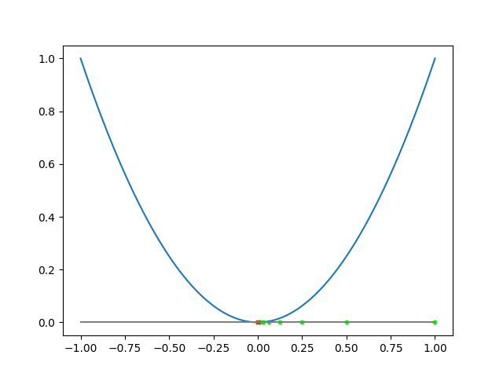
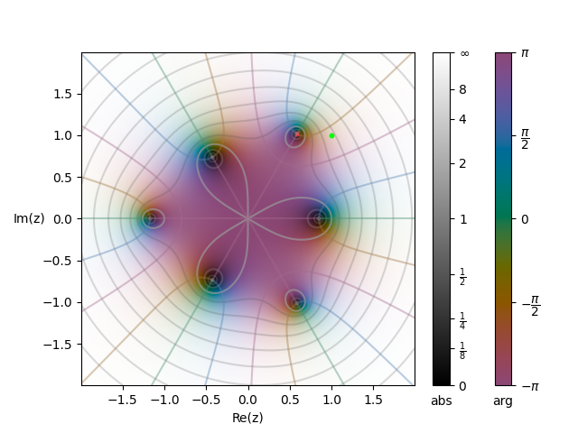

# Polynomial Complex Roots Finder Based on Newton's Method
*Jan Miksa*

*Created for Numerical Analisys course for Coputational Mathematics at Jagiellonian University*

## Usage
Files can be imported and used as mini libraries.  
- `newtonpolyroots.py` - Polynomial class, Newton's Method, Finding Roots
- `plots.py` - Util functions for plotting
### Requirements
- Pyton 3.x
### Installation
```
pip install -r requirements.txt
```
### Example
Example usage can be found in `test.py`.  
To run it: 
```
python test.py
```

Example output:
```
---Polynomial output test---
-1+0x^1+0x^2+1x^3+0x^4+0x^5+1x^6
---Henon test---
(-3-6j)
---Derivate test---
0+0x^1+3x^2+0x^3+0x^4+6x^5
---Newton test---
[((1+1j), (-3-6j)), ((0.8+0.9j), (-1.379377-1.8621360000000007j)), ((0.6054504677638066+0.8873335181726894j), (-0.8252927624679061-0.392558485076038j)), ((0.5309299767936839+1.044092121627571j), (-0.13427049963682702+0.5547465963348225j)), ((0.5813678881185717+1.0078424369895769j), (-0.09422503062981935+0.0038583820275300334j)), ((0.5871679647872429+1.016952337603088j), (0.0028272327299967426-0.00024267889675406654j)), ((0.5869926607983952+1.0167010257847484j), (2.3120949308452765e-06-3.99352074252569e-07j))]
---Roots test---
Calculating |################################| 1000000/1000000
[(-0.4258997473563901-0.7376801486968799j), (0.851799642555996+2.919535807018088e-10j), (0.5869925381385227-1.0167008068319503j), (-1.1739849966743174+1.6917638024453448e-11j), (-0.42589800586686444+0.7376795265308801j), (0.5869924171026455+1.0167008298682565j)]
```
### Example figures generated


